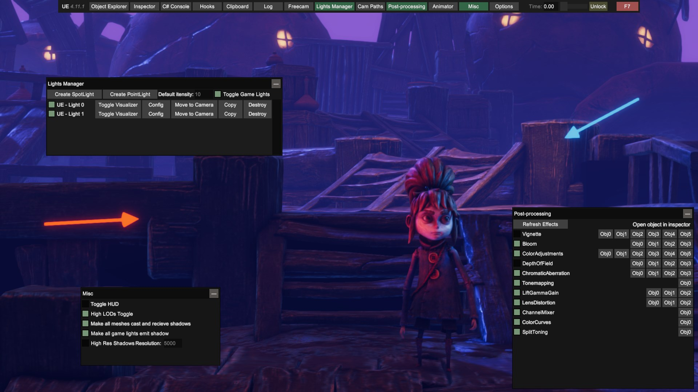

# Cinematic Unity Explorer

<p align="center">
  
</p>

<p align="center">
  🎥 Fork of the excellent UnityExplorer mod made by <a href="https://github.com/sinai-dev">sinai-dev</a> focused on providing tools for creating marketing material for Unity games.
</p>
<p align="center">
  To see the forks features I have worked on so far check out the <a href="#features">Features</a> section.
</p>
<p align="center">
  ✔️ Supports most Unity versions from 5.2 to 2021+ (IL2CPP and Mono).
</p>
<p align="center">
  ✨ Powered by <a href="https://github.com/yukieiji/UniverseLib">UniverseLib</a>
</p>

# Releases  [](../../releases)

[](../../releases/latest) [](https://github.com/originalnicodr/CinematicUnityExplorer/actions) [](../../releases/latest)

<p align="center">
<a href="https://www.youtube.com/watch?v=--8DOKWzGJ4" target="_blank">
  
</a>
<i>Trailer showcasing the fork features</i>
</p>

## Release schedule

Nightly builds can be found [here](https://github.com/originalnicodr/CinematicUnityExplorer/actions).

## BepInEx

| Release | IL2CPP(CoreCLR) | IL2CPP(Unhollower) | Mono |
| ------- | ------ |  ------ | ---- |
| BIE 6.X be.647+ | ✅ [link](https://github.com/originalnicodr/CinematicUnityExplorer/releases/latest/download/CinematicUnityExplorer.BepInEx.Unity.IL2CPP.CoreCLR.zip) | ✖️ n/a | ✅ [link](https://github.com/originalnicodr/CinematicUnityExplorer/releases/latest/download/CinematicUnityExplorer.BepInEx6.Unity.Mono.zip) |
| BIE 6.X be.472 to be.577 | ✅ [link](https://github.com/originalnicodr/CinematicUnityExplorer/releases/latest/download/CinematicUnityExplorer.BepInEx.IL2CPP.CoreCLR.zip) | ✅ [link](https://github.com/originalnicodr/CinematicUnityExplorer/releases/latest/download/CinematicUnityExplorer.BepInEx.IL2CPP.zip)  | ✅ [link](https://github.com/originalnicodr/CinematicUnityExplorer/releases/latest/download/CinematicUnityExplorer.BepInEx6.Mono.zip) |
| BIE 5.X | ✖️ n/a |  ✖️ n/a |  ✅ [link](https://github.com/originalnicodr/CinematicUnityExplorer/releases/latest/download/CinematicUnityExplorer.BepInEx5.Mono.zip) |

1. Unzip the release file into a folder
2. Take the `plugins/CinematicUnityExplorer` folder and place it in `BepInEx/plugins/`

<i>Note: BepInEx 6 is obtainable via [builds.bepinex.dev](https://builds.bepinex.dev/projects/bepinex_be)</i>

## MelonLoader

| Release | IL2CPP | Mono |
| ------- | ------ | ---- |
| ML 0.6.x  | ✅ [link](https://github.com/originalnicodr/CinematicUnityExplorer/releases/latest/download/CinematicUnityExplorer.MelonLoader.IL2CPP.CoreCLR.zip) | ✖️ |
| ML 0.6(only alpha build)  | ✅ [link](https://github.com/originalnicodr/CinematicUnityExplorer/releases/latest/download/CinematicUnityExplorer.MelonLoader.IL2CPP.net6preview.zip) | ✖️ |
| ML 0.5  | ✅ [link](https://github.com/originalnicodr/CinematicUnityExplorer/releases/latest/download/CinematicUnityExplorer.MelonLoader.IL2CPP.zip) | ✅ [link](https://github.com/originalnicodr/CinematicUnityExplorer/releases/latest/download/CinematicUnityExplorer.MelonLoader.Mono.zip) | 

1. Unzip the release file into a folder
2. Copy the DLL inside the `Mods` folder into your MelonLoader `Mods` folder
3. Copy all of the DLLs inside the `UserLibs` folder into your MelonLoader `UserLibs` folder

## Standalone

| IL2CPP | Mono |
| ------ | ---- |
| ✅ [link](https://github.com/originalnicodr/CinematicUnityExplorer/releases/latest/download/CinematicUnityExplorer.Standalone.IL2CPP.zip) | ✅ [link](https://github.com/originalnicodr/CinematicUnityExplorer/releases/latest/download/CinematicUnityExplorer.Standalone.Mono.zip) | 

The standalone release can be used with any injector or loader of your choice, but it requires you to load the dependencies manually.

1. Ensure the required libs are loaded - UniverseLib, HarmonyX and MonoMod. Take them from the [`CinematicUnityExplorer.Editor`](https://github.com/originalnicodr/CinematicUnityExplorer/releases/latest/download/CinematicUnityExplorer.Editor.zip) release if you need them.
2. For IL2CPP, load Il2CppAssemblyUnhollower and start an [Il2CppAssemblyUnhollower runtime](https://github.com/knah/Il2CppAssemblyUnhollower#required-external-setup)
2. Load the CinematicUnityExplorer DLL
3. Create an instance of Unity Explorer with `UnityExplorer.ExplorerStandalone.CreateInstance();`
4. Optionally subscribe to the `ExplorerStandalone.OnLog` event to handle logging if you wish

## Unity Editor

1. Download the [`CinematicUnityExplorer.Editor`](https://github.com/originalnicodr/CinematicUnityExplorer/releases/latest/download/CinematicUnityExplorer.Editor.zip) release.
2. Install the package, either by using the Package Manager and importing the `package.json` file, or by manually dragging the folder into your `Assets` folder.
3. Drag the `Runtime/CinematicUnityExplorer` prefab into your scene, or create a GameObject and add the `Explorer Editor Behaviour` script to it.

# Common issues and solutions

Although CinematicUnityExplorer should work out of the box for most Unity games, in some cases you may need to tweak the settings for it to work properly.

To adjust the settings, open the config file:
* BepInEx: `BepInEx\config\com.originalnicodr.cinematicunityexplorer.cfg`
* MelonLoader: `UserData\MelonPreferences.cfg`
* Standalone: `CinematicUnityExplorer\config.cfg`

Try adjusting the following settings and see if it fixes your issues:
* `Startup_Delay_Time` - increase to 5-10 seconds (or more as needed), can fix issues with CinematicUnityExplorer being destroyed or corrupted during startup.
* `Disable_EventSystem_Override` - if input is not working properly, try setting this to `true`.

If these fixes do not work, please create an issue in this repo and I'll do my best to look into it.

# Guide and documentation

I wrote a [guide](https://framedsc.com/GeneralGuides/cinematic-unity-explorer.htm) explaining different things regarding the Cinematic Unity Explorer over the Framed website, from knowing what version to download with your game and troubleshooting, to usage and tips and tricks. Feel free to create a PR on the [Framed GitHub repo](https://github.com/framedsc/Sitesource) if you want to improve it.

# Default Hotkeys

The table below describes all of the relevant default hotkeys. You can edit them to your liking by going to the Options panel, changing the hotkeys you want, and saving the settings.

Feature | Key
-|-
Freecam | `Insert`
Move the camera forward/left/right/backward | `W`/`A`/`S`/`D` - `UpArrow`/`LeftArrow`/`RightArrow`/`DownArrow`
Move the camera upwards | `Space`
Move the camera downwards | `LeftControl`
Speed up movement | `LeftShift`
Speed down movement | `LeftAlt`
Change freecam orientation | Right mouse click
Tilt left | `Numpad 1`
Tilt right | `Numpad 3`
Reset tilt | `Numpad 2`
Increase FOV | `Numpad +`
Decrease FOV | `Numpad -`
Reset FOV | `Numpad *`
Pause | `PageUp`
Block Freecam movement and rotation | `Home`
Block games input | `Numpad .`
Frameskip | `PageDown`
HUD Toggle | `Delete`
Freeze NPC animations | `Numpad 0`

# Features

The following are the features I developed for this fork. All focused on making things easier for capture artists to get marketing material for studios.

If you found a bug or a problem (or want to see the things I want to work on) head over to the [issues page](https://github.com/originalnicodr/CinematicUnityExplorer/issues).

## Improved Freecam

The original Unity Explorer had a Freecam feature, but even if it was useful at the time it had a lot of quirks that could be ironed out, so I did. The following are the changes and improvements I made over the original UnityExplorer freecam:

- The Freecam can now move when the game is paused.
- Added tilt support.
- Added FOV control support.
- Added near and far clip sliders on the Freecam panel, to cut out objects near the camera out of view, or include more scene objects on sight.
- Automatically disable the Cinemachine component if present when using the gameplay camera, to avoid the game from trying to take control.
- Added a toggle to block the freecam from moving with user input.
- Unlocked the mouse on freecam even when the mod UI is hidden.
- The freecam resets its position and orientation when changing scenes, to avoid getting it into weird locations when turning it on again after switching levels.
- Blocked rotation from going further when looking directly up or directly down.

### Follow Object
You can click on the "Follow object" button on the panel and select the object you want the camera to follow or click on the "Follow object" button in the inspector screen for more granularity. This can be used as it is, but it's even more useful when playing with [camera paths](#camera-paths), as you can create a path for the camera to walk relative to the object

By default the camera only follows the object's position, but you can also make it follow its rotation as if the camera was physically bound to the object by checking the "Follow Object Rotation" toggle. Should be useful for mimicking a car camera, a character POV, or creating motion blur.

### Game input block for Unity's legacy system
Added game input block for Unity's legacy system. You can now block (or unblock) the game's input when using the freecam, as long as the game is using the Unity Legacy Input system. If the game uses a custom solution or the latest Unity system then this won't work. Implementing this for Unity's new system is in the backlog, so if you find a game using it (should say "Initialized new InputSystem support." on the logs) then please let me know so I can implement it using that game!

## Lights manager
It allows you to spawn spotlights and pointlights, as well as toggle the game's original lights to allow you to relight the scene however you want (a task that is pretty common for screenshots and lighting artists). Please note that this only turns off scene lights and won't turn off ambient light or lights created by emissive materials, effects, or shaders.

<p align="center">
  <a href="https://raw.githubusercontent.com/originalnicodr/CinematicUnityExplorer/master/img/lights_demo.jpg">
    
  </a>
</p>

You can edit the light parameters by clicking on the "Config" button. There might be a ton of stuff there, but you would want to focus on these properties:

- **Intensity**: How strong the light is. 
- **Range**: How far the light travels.
- **Color**: Pretty self explanatory.
- **Color Temperature**: In case you want to use more natural colors. You would also need to enable the `useColorTemperature` property.
- **Spot Angle**: The angle of the spotlight (bigger means wider).

If you want to move an already created light you can use the "Move to Camera" option after positioning the camera. But if you need to fine-tune its position or orientation you can do so by clicking on the "Config" button, "Inspect Game Object", and editing the position and rotation from there.

There also is a default intensity input field on the panel. Since the intensity varies a lot from game to game you have to increase/decrease this property on a light until it looks right, and once you figure out a value that works for your game you can write it as the default intensity and don't have to edit it on the new lights you spawn from that point.

### Visualizer
You can also draw an arrow or sphere representing the light source from spotlights and point lights respectively, to understand your light setups better. To do so click on the "Toggle visualizer" button on a light in the panel.

## Camera paths
It allows you to create nodes to build camera paths for videos and cinematics. Features include:

- Add and delete camera path nodes.
- Copy camera position and rotation to an existing node.
- Copy camera FoV to an existing node.
- Change the camera position and rotation to the ones in an existing node.
- Specify the time it takes the camera to complete the path (as long as the game is playing at capped 60fps), defining its speed in the process.
- Close the camera path in a loop toggler.
- Unpause on play toggler.
- Pause on finish toggler.
- Wait 3 seconds before start toggler.
- Move nodes up or down on the list.
- Control over the tension and alpha values of the path, which are curve constants that change the resulting path created from the nodes. Their effect can be clearly seen when visualizing the path, as explained below.

As a side note, the mod UI will be disabled once the path starts, to ease video recording.

### Visualizer
Similarly to the Light Manager, you can visualize a camera path with arrows, whose origin and orientation represent the position and orientation that the camera will have at that point in the curve. You can turn this on by clicking on the "Visualize path" checkbox. Keep in mind that this will be turned off once the path starts playing since its purpose is to help the user set up the path itself.

## Post-processing panel
It loads all the current vanilla post-processing effects being used and offers togglers to disable them. It also lets you inspect the postprocessing objects yourself if you want to edit their parameters instead.

[Shader toggler](https://github.com/FransBouma/ShaderToggler) would still be preferred (especially as it will be able to catch custom effects that this mod can't), but it might still be useful for some.

## Animator
Allows you to manually play characters and NPC animations in a scene. This should be pretty useful for getting the right animation on each enemy to set up marketing screenshots.

Favorite animations so they appear first on the dropdown list by clicking on the star button with the animation selected.

The Animator Panel also allows you to freeze all characters in a scene all at once, alongside giving you control over which characters should ignore the master toggler. That way you can make the playable character avoid getting frozen, or avoid un-freezing NPCs or enemies that already have the animations you want them to have.

Alongside all of this, you can also open each character game object by clicking on their names, so you can move, rotate, scale them around, disable them, or further edit their properties and child objects.

## Misc Panel
- HUD toggle.
- Force high LODs toggle. This means that the highest models possible will be forced on all meshes.
- Screenshot support. Allows you to momentarily render the game at a higher resolution than the one being used and take a screenshot. You can enter the multiplier of the current resolution at which the screenshot should render in the "Supersize" field.
  - Unity games tend to be easily [hotsampeable](https://framedsc.com/basics.htm#hotsampling), but I still thought it could be useful for people who do marketing work and don't use Reshade effects on their work. Please take in mind that using this function will not save the screenshot with Reshade effects, as these get rendered outside of the engine.
  - Screenshots are saved inside `BepInEx\plugins\CinematicUnityExplorer\Screenshots` by default, in png format.
  - You can also set up a hotkey for it on the Options panel.
- Toggle to make all meshes cast and receive shadows.
- Toggle to make all game lights emit shadows.
- Toggle to change the resolution of shadows generated by the game's vanilla lights. Beware using this one with the two options from above. Also, take in mind that lights created with the Light Manager already generate high-resolution shadows.

## And more!
- Refactored the pause to make it more reliable.
- Hotkey to pause the game.
- Added a slider to the TimeScale.
- Frameskip. Once the game is paused you can press the frameskip hotkey to skip one frame, to get just the right animation for your action shots.
- Added assignable hotkeys on the Options panel, all of which are displayed on the freecam panel.
- Made the mod UI scale with higher resolutions.

# Why a fork instead of making a new mod?

It wasn't the original intention to develop this fork to its current state. I just wanted to make it easier for me and my friends to take screenshots of Unity games and it rolled from there. It is in fact true that me modifying an already existing generic mod streamlined things instead of doing everything from zero, but it's also true that some of UnityExplorer vanilla functionality is useful for doing marketing-related stuff as well (as well as allowing some features to work by letting the user get their hands dirty, e.g. unlocking the gameplay freecam).

Maybe I would make a separate version one day, but for now, it is what it is.

# Vanilla UnityExplorer Features

The following are features from the original UnityExplorer project which I have not made myself.

<p align="center">
  <a href="https://raw.githubusercontent.com/originalnicodr/CinematicUnityExplorer/master/img/preview.png">
    
  </a>
</p>

### Inspector API

If you want to inspect an object or Type from outside the C# console, use the `InspectorManager` class:

**To inspect an object:**
```csharp
UnityExplorer.InspectorManager.Inspect(theObject);
```

**To inspect a Type:**
```cs
UnityExplorer.InspectorManager.Inspect(typeof(SomeClass));
```

### Object Explorer

* Use the <b>Scene Explorer</b> tab to traverse the active scenes, as well as the DontDestroyOnLoad and HideAndDontSave objects.
  * The "HideAndDontSave" scene contains objects with that flag, as well as Assets and Resources which are not in any scene but behave the same way.
  * You can use the Scene Loader to easily load any of the scenes in the build (may not work for Unity 5.X games)
* Use the <b>Object Search</b> tab to search for Unity objects (including GameObjects, Components, etc), C# Singletons or Static Classes.
  * Use the UnityObject search to look for any objects which derive from `UnityEngine.Object`, with optional filters
  * The singleton search will look for any classes with a typical "Instance" field, and check it for a current value. This may cause unexpected behaviour in some IL2CPP games as we cannot distinguish between true properties and field-properties, so some property accessors will be invoked.

### Inspector

The inspector is used to see detailed information on objects of any type and manipulate their values, as well as to inspect C# Classes with static reflection.

* The <b>GameObject Inspector</b> (tab prefix `[G]`) is used to inspect a `GameObject`, and to see and manipulate its Transform and Components.
  * You can edit any of the input fields in the inspector (excluding readonly fields) and press <b>Enter</b> to apply your changes. You can also do this to the GameObject path as a way to change the GameObject's parent. Press the <b>Escape</b> key to cancel your edits.
  * <i>note: When inspecting a GameObject with a Canvas, the transform controls may be overridden by the RectTransform anchors.</i>
* The <b>Reflection Inspectors</b> (tab prefix `[R]` and `[S]`) are used for everything else
  * Automatic updating is not enabled by default, and you must press Apply for any changes you make to take effect.
  * Press the `▼` button to expand certain values such as strings, enums, lists, dictionaries, some structs, etc
  * Use the filters at the top to quickly find the members you are looking for
  * For `Texture2D`, `Image`, `Sprite` and `Material` objects, there is a `View Texture` button at the top of the inspector which lets you view the Texture(s) and save them as a PNG file. 
  * For `AudioClip` objects there is a `Show Player` button which opens an audio player widget. For clips which are loaded as `DecompressOnLoad`, there is also a button to save them to a `.wav` file. 

### C# Console

* The C# Console uses the `Mono.CSharp.Evaluator` to define temporary classes or run immediate REPL code.
* You can execute a script automatically on startup by naming it `startup.cs` and placing it in the `CinematicUnityExplorer\Scripts\` folder (this folder will be created where you placed the DLL file).
* See the "Help" dropdown in the C# console menu for more detailed information.

### Hook Manager

* The Hooks panel allows you to hook methods at the click of a button for debugging purposes.
  * Simply enter any class and hook the methods you want from the menu. 
  * You can edit the source code of the generated hook with the "Edit Hook Source" button. Accepted method names are `Prefix` (which can return `bool` or `void`), `Postfix`, `Finalizer` (which can return `Exception` or `void`), and `Transpiler` (which must return `IEnumerable<HarmonyLib.CodeInstruction>`). You can define multiple patches if you wish.

### Mouse-Inspect

* The "Mouse Inspect" dropdown in the "Inspector" panel allows you to inspect objects under the mouse.
  * <b>World</b>: uses Physics.Raycast to look for Colliders
  * <b>UI</b>: uses GraphicRaycasters to find UI objects

### Freecam

* CinematicUnityExplorer provides a basic Free Camera which you can control with your keyboard and mouse.
* Unlike all other features of CinematicUnityExplorer, you can still use Freecam while CinematicUnityExplorer's menu is hidden.
* Supports using the game's main Camera or a separate custom Camera.
* See the Freecam panel for further instructions and details.

### Clipboard

* The "Clipboard" panel allows you to see your current paste value, or clear it (resets it to `null`)
  * Can copy the value from any member in a Reflection Inspector, Enumerable or Dictionary, and from the target of any Inspector tab
  * Can paste values onto any member in a Reflection Inspector
  * Non-parsable arguments in Method/Property Evaluators allow pasting values
  * The C# Console has helper methods `Copy(obj)` and `Paste()` for accessing the Clipboard

### Settings

* You can change the settings via the "Options" tab of the menu, or directly from the config file.
  * BepInEx: `BepInEx\config\com.originalnicodr.cinematicunityexplorer.cfg`
  * MelonLoader: `UserData\MelonPreferences.cfg`
  * Standalone `{DLL_location}\CinematicUnityExplorer\config.cfg`

# Building

1. Run the `build.ps1` powershell script to build CinematicUnityExplorer. Releases are found in the `Release` folder.

Building individual configurations from your IDE is fine, though note that the intial build process builds into `Release/<version>/...` instead of the subfolders that the powershell script uses. Batch building is not currently supported with the project.

# Showcase

A non-exhaustive list of games that have used this project for making marketing material:

- [My Time at Sandrock](https://store.steampowered.com/app/1084600/My_Time_at_Sandrock/)
- [Void Crew](https://store.steampowered.com/app/1063420/Void_Crew/)

Did you use this mod for your project? Hit me up and let me know! I would love to check it out!

Even tho it's not necessary, if you happen to use this mod in the marketing campaign of a commercial project and find it useful please consider including it in the credits!

# Acknowledgments

* [sinai-dev](https://github.com/sinai-dev/) for their incredible work on the original UnityExplorer.
* [yukieiji](https://github.com/yukieiji/) for their awesome work on mainting [their fork](https://github.com/yukieiji/UnityExplorer) of UnityExplorer giving support to new versions of the engine.
* [ManlyMarco](https://github.com/ManlyMarco) for [Runtime Unity Editor](https://github.com/ManlyMarco/RuntimeUnityEditor) \[[license](THIRDPARTY_LICENSES.md#runtimeunityeditor-license)\], the ScriptEvaluator from RUE's REPL console was used as the base for UnityExplorer's C# console.
* [Geoffrey Horsington](https://github.com/ghorsington) for [mcs-unity](https://github.com/sinai-dev/mcs-unity) \[no license\], used as the `Mono.CSharp` reference for the C# Console.

# Support

If you have found this project fun or useful in any capacity please consider [supporting me on Ko-fi](https://ko-fi.com/originalnicodr). And please also consider donating to the people in the acknowledgments above! As well as the mod loader maintainers.

Also, if you happen to use this on a commercial project, please let me know! Would love to see what this project helped create!

### Disclaimer

CinematicUnityExplorer is in no way associated with Unity Technologies. "Unity", Unity logos, and other Unity trademarks are trademarks or registered trademarks of Unity Technologies or its affiliates in the U.S. and elsewhere.
